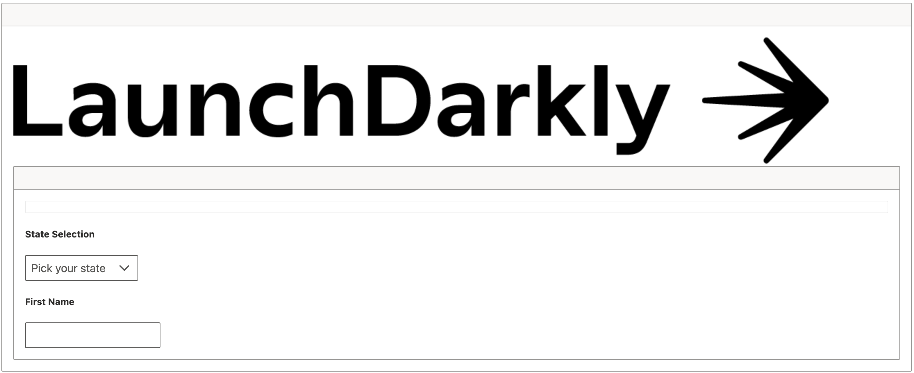

# Where's the best Vue around? <br>The one that was launched darkly!

## Introduction

First, a quick start of Vue, I won't dig in deep because there are far better places to learn Vue than from me, like the [official Vue.js website](https://vuejs.org/guide/introduction.html).

If you're really new to web development, this is going to go fast, but you should have what you need to get started and then you can jump in the way back machine to go unpack all the things we went through at light speed.

I love acceleration, so I'm going to give you the fastest start I can. 
My favorite thing when I'm learning something new is to skip all the things I don't care too much about (for now) and get right down to the important stuff.

If you don't want the backstory, [jump to the doing!](#lets-go-build)

Also, if you're not so much of the reading type and you want a guided video tour, check this out on YouTube.

In this example, I think I've got the shortest route to a deployed working Vue app with Feature Management through LaunchDarkly. 
I'm sure there are opportunities to optimize, improve the workflow, but I think this should give you an example that will get you off the ground fast and grok how things work.

Since we're going to go fast, I won't do my explaining of how Vue works here, but rather through comments in the code. I will make sure to explain all the things I do with LaunchDarkly in this project though.


## Project Setup Explanation [:fast_forward:](#lets-go-build)

A couple of things that tend to drive my choices in setting up a project or building an app:

### I have 99 problems

I have lots of problems to solve, I want to focus on the ones that matter most **first** so I use tools to get lower priority problems out of my way, for me they're accelerators. My #1 job here is to build my new exciting Vue app, fast!

1. **Problem #2** - I need to ship fast, safely, and have tons of control over my releases

   - I need feature management that just works for my new Vue app, luckily there's a LaunchDarkly SDK for that!

2. **Problem #27** - I need to have a site that's pretty enough, but I am no designer.

   - [PrimeVue](https://www.primefaces.org/primevue/) has a lot going for it, the docs feel a little sparse, I only went deep enough to demonstrate some of the power in launching darkly. Of the component libraries in the Vue space, [PrimeVue](https://www.primefaces.org/primevue/) felt the easiest to adopt with the least "other stuff" I had to do.
   - There are some other popular options, each one comes with its own challenges. I found [this post](https://www.mindinventory.com/blog/vuejs-ui-component-libraries-frameworks/) particularly useful in finding some options with some obersvations about the pros & cons of each. Highly recommend!

3. **Problem #17** - Modern apps get bundled and bundling can be a pain, I need less pain.
   - I chose [Vite](https://vitejs.dev/) as my bundler. I didn't want to spend a lot of time curating a bundler config to get this working and Vite made it extra easy to scaffold and get started. If you want to know more, check out the "why" behind [Vite](https://vitejs.dev/) here: https://vitejs.dev/guide/why.html
   - You could use [webpack](https://webpack.js.org/), [Parcel](https://parceljs.org/), or the [Vue CLI](https://cli.vuejs.org/). 
      I don't know enough about the options to recommend one, but I can say [Vite](https://vitejs.dev/) made my life easier and got me to production fast with very little config.

4. **Problem #13** - I need a place to run this thing.

   - I need a [live demo link](https://launchdarkly-vue-demo.netlify.app/) so you can trust me that this actually works. and 

   - It's just not worth the cognitive load to worry much about the "how" this gets out there because I know my project evolving

      I need a way to quickly:

      - ship
      - change
      - repeat

   - Enter [Netlify](https://www.netlify.com/). I'm not sure there's an easier way to run a web application than [Netlify](https://www.netlify.com/). 
      With a few quick commands, I had a new site setup for Netlify, hooks into my repo in Github so changes are automatically deployed, and I even had a place for injecting secrets into my app via Netlify all within their free tier.

      - I have included Netlify config file, `netlify.toml` which you can customize, use, or ignore, depending on how much :rocket: you want for free.
      - I have also included scripts to setup Netlify for you once you have an account and an access key.
      - :information_desk_person: don't feel obliged to do the Netlify piece, it's a side-quest, but if you want to see your app live and show it to friends and family, it's super easy and it's cool to see your stuff live for free!

### I :heart: to learn *fast*

1. I like to catch mistakes *sooner*
   1. I used [Typescript](https://www.typescriptlang.org/) in this project (don't @ me) here's why:
      - If I had a relationship status with types, it would be `it's complicated`. 
      - I love **some** typechecking at development and build time because it helps catch my mistakes sooner. 
         I used Typescript sparingly in this project to give me a little more confidence as I built.
      - Types help me understand interfaces faster, so I :heart: when libraries ship their types so I don't need to look at their docs so much or worse yet, dig into their source code.
   2. I love TDD, [test-driven development](https://testdriven.io/test-driven-development/), for the same reason I like types. I chose not to include tests in this repo here because:
      - When I'm learning a new paradigm, testing actually feels like it gets in the way
      - I'm unfamiliar with testing in the Vue space, so I'll save that for another time.

## Let's go build!

### Prerequisites

1. A [LaunchDarkly](https://launchdarkly.com) account
   1. Super easy to setup if you don't have one already [SIgn Up Page](https://launchdarkly.com/pricing/)
   2. Everything you need to start dark launching is included in the starter package, so unless you need more, just start a free trial of the starter, no credit card required, no payment for the duration of your trial.
2. [Node.js](https://nodejs.org/) & [NPM](https://docs.npmjs.com/cli) installed
   If changing versions is a pain for you, have you heard of [NVM](https://github.com/nvm-sh/nvm)?
   1. Node version `18.6+` recommended
   2. NPM version `8.13+` recommended
   3. I included a  `.nvmrc` in the template repo so NVM can automatically detect what you need for versions if you've got it installed.
3. [Git](https://git-scm.com/) installed (optional, but recommended)
   1. You don't actually have to have it, it's just highly recommended so you have a baseline (my code) and a way to see your changes over time.
   2. If you don't have it installed, it's really easy! Just follow these directions: [Git Install Instructions](https://git-scm.com/book/en/v2/Getting-Started-Installing-Git) 

### Scaffolding

#### Here's how I scaffolded my app:

```zsh
# reference https://vitejs.dev/guide/#scaffolding-your-first-vite-project
npm create vite@latest launchdarkly-vue-sdk-demo -- --template vue
```

For you, I'm going to make it even easier thanks to a little help from my friend [degit](https://github.com/Rich-Harris/degit "straightforward project scaffolding")

```shell
# starts you with a shallow clone of my starter template on Github
npx degit halex5000/launchdarkly-vue-sdk-demo#stable my-project
```

Why `degit` from a template repo? I :heart: accelerators and [degit is faster](https://github.com/Rich-Harris/degit#wait-isnt-this-just-git-clone---depth-1) than cloning.

#### :rocket: Now to get you live!

##### If you want to run locally, you can just follow these steps:

1. ```shell
   cd my-project
   ```

2. ```shell
   npm install	
   ```

3. ```shell
   npm run dev
   ```

4. If it all worked right, your app is running and it just opened in your local browser at http://localhost:5173

##### :construction: Sort of, just a few steps left to see it really work:

Choose your own adventure:

- Login to LaunchDarkly if you're not already.

- **Option 1**: Run a script to scaffold things

  - Go to https://app.launchdarkly.com/settings/authorization/tokens/new and create a new access token for your account, we're going to use it to setup your flags with a little script you can run.
  - Name your token something helpful like `vue-sdk-demo-token` that way you can find it easily later or remove it's access if you no longer need it.
  - Make sure to give your token the Role of `Admin`
  - Leave API version as it is
  - Click `Save token`
  - Go into your newly created project and run `npx ld-jumpstarter create`
  - `ld-jumpstarter` will create the flags we need in your account in LaunchDarkly. 

- **Option 2**: Set things up manually [here](https://app.launchdarkly.com/default/test/features/new), (it goes really quickly)

  - The **Key** is the :key: if you change it, make sure to change the code, that's what we're depending on.

  - :warning: be sure to check "SDKs using Client-side ID" for each flag as you create it, if it's not already checked.

  - Create the following flags:

    - **Available States** (`JSON`)

      - Description: List of states to allow

      - Key: `available-states`

      - Variations: (use whatever you want here, it just needs to be a JSON array of States)

        - ```json
          [ "MA", "NH", "ME", "CT", "RI" ]
          ```

        - ```json
          [ "CA", "FL", "TX" ]
          ```

    - **First Name Validation Rules** (`JSON`)

      - Description: Used for validating user first name

      - Key: `first-name-validation-rules`

      - Variations:

        - Original Rule

          ```json
          { "maxLength": 10, "minLength": 4 }
          ```

        - Updated Rule

          ```json
          { "maxLength": 27, "minLength": 2 }
          ```

    - **Menu Options** (`JSON`)

      - Description: Dynamically describe the menu options in the form

      - Key: `menu-options`

      - Variations:

        - No menu options

          - ```json
            []
            ```

        - Some menu options

          - ```json
            [ { "icon": "pi pi-fw pi-file", "items": [ { "icon": "pi pi-fw pi-plus", "items": [ { "icon": "pi pi-fw pi-bookmark", "label": "Bookmark" }, { "icon": "pi pi-fw pi-video", "label": "Video" } ], "label": "New" }, { "icon": "pi pi-fw pi-trash", "label": "Delete" }, { "separator": true }, { "icon": "pi pi-fw pi-external-link", "label": "Export" } ], "label": "File" } ]
            ```

    - **Progress Speed** (`Number`)

      - Description: Controls the speed at which we show progress in loading the SDK
      - Key: `progress-speed`
      - Variations:
        - Slow :snail:
          - 500
        - Fast! :bullettrain_front:
          - 10

    - **Header Image** (`String`)

      - Description: Controls the path to the header image
      - Key: `header-image`
      - Variations:
        - Badger
          - `./logo.png`
        - LaunchDarkly Official
          - `./logo.jpeg`
        - The Better Badger Header
          - `./LaunchDarkly-black.png`

    - **Display Feature Flag** (`Boolean`)

      - Description: Used to control the display speed of the initializer
      - Key: `display-feature-flag`
      - Variations: (just use the defaults)

#### :champagne: You made it, Let's pop some flags!:champagne:

By now, you should have a working, running app (locally), I'll explain how to ship to Netlify at the end of this post so you can see how :zap:ridiculously fast:zap: you can see feature flag changes even in deployed apps.

Starting off, it should look like this



Official


   

   


